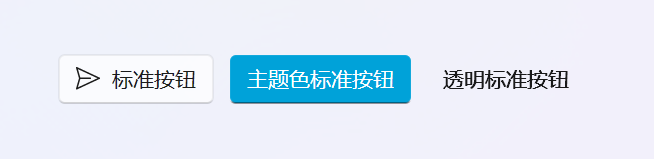
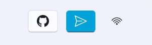
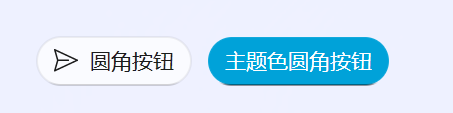
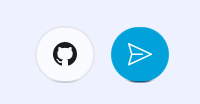
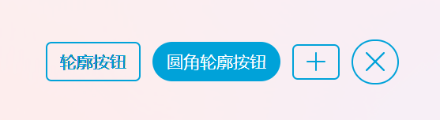
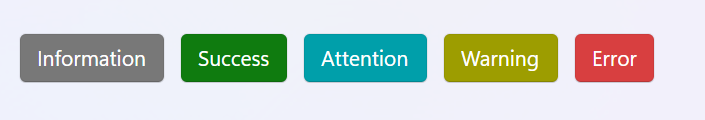
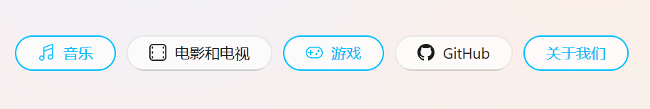
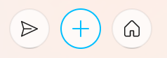
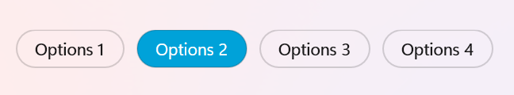
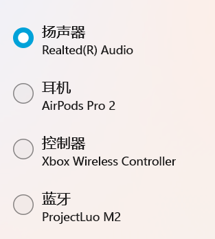

# 按钮

按钮控件用于触发操作或命令。

## 普通按钮 (PushButton)

<div align="center">
  
</div>

```xml
<ui:PushButton Content="标准按钮" IconData="{StaticResource Send}"/>
<ui:PushButton Classes="Accent" Content="主题色标准按钮"/>
<ui:PushButton Content="透明标准按钮" Theme="{StaticResource TransparentPushButton}"/>
```

## 工具按钮 (ToolButton)

只显示图标的按钮，通常用于工具栏。

<div align="center">
  
</div>

```xml
<ui:ToolButton IconData="{StaticResource GitHub}"/>
<ui:ToolButton Classes="Accent" IconData="{StaticResource Send}"/>
<ui:ToolButton IconData="{StaticResource Wifi}" Theme="{StaticResource TransparentToolButton}"/>
```

## 圆角按钮

<div align="center">
  
</div>

```xml
<ui:PushButton
      Classes="Round"
      Content="圆角按钮"
      IconData="{StaticResource Send}"/>
    <ui:PushButton Classes="Accent Round" Content="主题色圆角按钮"/>
```

## 圆角工具按钮

<div align="center">
  
</div>

```xml
<ui:ToolButton Classes="Round" IconData="{StaticResource GitHub}"/>
<ui:ToolButton Classes="Accent Round" IconData="{StaticResource Send}"/>
```

## 轮廓按钮

<div align="center">
  
</div>

```xml
<ui:PushButton Classes="Outlined" Content="轮廓按钮"/>
<ui:PushButton Classes="Outlined Round" Content="圆角轮廓按钮"/>
<ui:ToolButton Classes="Outlined" IconData="{StaticResource Add}"/>
<ui:ToolButton Classes="Outlined Round" IconData="{StaticResource Close}"/>
```

## 填充按钮 (FilledPushButton)

带背景填充的按钮样式。

<div align="center">
  
</div>

```xml
<ui:FilledPushButton Content="Information"/>
<ui:FilledPushButton Classes="Success" Content="Success"/>
<ui:FilledPushButton Classes="Attention" Content="Attention"/>
<ui:FilledPushButton Classes="Warning" Content="Warning"/>
<ui:FilledPushButton Classes="Error" Content="Error"/>
```

## 描边按钮 (OutlinePushButton)

#### 加入不同的组可启用单选多选功能

<div align="center">
  
</div>

```xml
<ui:OutlinePushButton
    Content="音乐"
    GroupName="Group1"
    IconData="{StaticResource Music}"/>
<ui:OutlinePushButton
    Content="电影和电视"
    GroupName="Group1"
    IconData="{StaticResource Video}"/>
<ui:OutlinePushButton
    Content="游戏"
    GroupName="Group2"
    IconData="{StaticResource Game}"/>
<ui:OutlinePushButton
    Content="GitHub"
    GroupName="Group2"
    IconData="{StaticResource GitHub}"/>
<ui:OutlinePushButton Content="关于我们"/>
```


## 描边工具按钮 (OutlinedToolButton)

<div align="center">
  
</div>

```xml
<ui:OutlineToolButton IconData="{StaticResource Send}"/>
<ui:OutlineToolButton IconData="{StaticResource Add}"/>
<ui:OutlineToolButton IconData="{StaticResource Home}"/>
```

## 胶囊单选按钮

<div align="center">
  
</div>

```xml
<RadioButton Content="Options 1" Theme="{StaticResource ChipsRadioButton}"/>
<RadioButton Content="Options 2" Theme="{StaticResource ChipsRadioButton}"/>
<RadioButton Content="Options 3" Theme="{StaticResource ChipsRadioButton}"/>
<RadioButton Content="Options 4" Theme="{StaticResource ChipsRadioButton}"/>
```

## 带子标题的单选按钮 (SubTitleRadioButton)
<div align="center">
  
</div>

```xml
<ui:SubTitleRadioButton Content="扬声器" SubTitle="Realted(R) Audio"/>
<ui:SubTitleRadioButton Content="耳机" SubTitle="AirPods Pro 2"/>
<ui:SubTitleRadioButton Content="控制器" SubTitle="Xbox Wireless Controller"/>
<ui:SubTitleRadioButton Content="蓝牙" SubTitle="ProjectLuo M2"/>
```